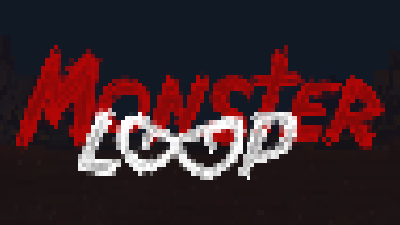
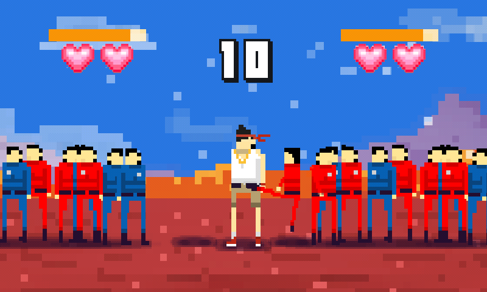
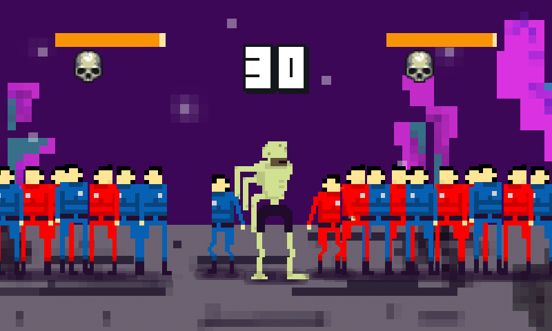

# About

This game was made on Ludum Dare #33. It's a simple mobile game where gamer must to swype up/down for defend self from enemies. And if gamer fails main hero transform to monster. This game does not completed yet. We didn't have much time on jam and that because we have few little bugs in gameplay;)

The game was written on Lua and [Gideros Studio](http://giderosmobile.com/).

Ludum dare compo page with other OS versions: [here](http://ludumdare.com/compo/ludum-dare-33/?action=preview&uid=57654)

# How to play

When hero is man you must to swype up blue enemies, and red - down. You can see how much you failed from both side. When lives ends you transform to monster and then you must to swype blue enemies to down, and red - up. That’s all. Enjoy;)

# Screenshots

